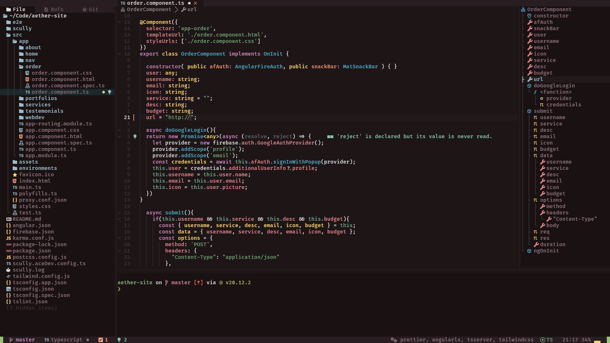

# Ares.nvim

## A Warm Neovim theme for the Warm-Blooded ⚔️



Ares.nvim uses [lush.nvim](https://github.com/rktjmp/lush.nvim/tree/main) for setting it's colors

## Requirements

- Neovim 0.7 or greater
- `termguicolors` enabled for true color support

## Installation

Install via any package management system

- Lazy.nvim

```vim
'rktjmp/lush.nvim',
{'ab-dx/ares.nvim', name='ares', priority=1000}
```

- paq-nvim

```vim
require paq { 'rktjmp/lush.nvim' }
require paq { 'ab-dx/ares.nvim' }
```

- Packer

```vim
use 'rktjmp/lush.nvim'
use 'ab-dx/ares.nvim'
```

## License

[MIT](https://choosealicense.com/licenses/mit/)
